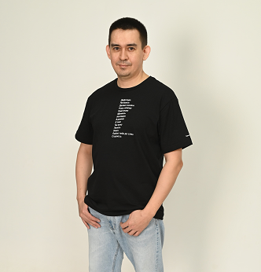

# Каримов Ильдар

 

**Контакты:**  
+7(986)978-39-34  

Telegram:
   
E-mail: 
  
Portfolio:

  

## Аналитик данных

Специализации:
- Дата-сайентист
- BI-аналитик, аналитик данных
- Аналитик

Занятость: полная занятость.   
График работы: полный день, удаленная работа.  
Уфа, готов к переезду, готов к командировкам.

## Навыки: 
`Python`, `Pandas`, `SQL`, `PostgreSQL`, `MS Excel`, `Tableau`, `MS PowerPoint`, `Atlassian Confluence`, `Trello`, `Jira`, `Redash`,
`github`, `Jupyter Notebook`

## Опыт работы
### Март 2022 — март 2023
**Студент курса "Аналитик данных" Решение практических задач в области анализа данных:**

Решение практических задач в области анализа данных:

- [Анализ базы данных сервиса для чтения книг с использованием SQL](https://github.com/usr036943/yandex_practicum_projects/tree/main/9.%20Анализ%20базы%20данных%20сервиса%20для%20чтения%20книг%20с%20использованием%20SQL).
Описание: проанализировать базу данных, сформулировать ценностное предложение для нового продукта.
Инструменты: `pandas`, `sqlalchemy`, `SQL`.
- [Исследование надёжности заёмщиков — анализ банковских данных](https://github.com/usr036943/yandex_practicum_projects/tree/main/1.%20Исследование%20надёжности%20заёмщиков).
Описание: исследовать влияет ли семейное положение и количество детей клиента на факт возврата кредита в срок.
Инструменты: `Pandas`, `категоризация данных`.
- [Определение выгодного тарифа для телеком компании](https://github.com/usr036943/yandex_practicum_projects/tree/main/3.%20Определение%20перспективного%20тарифа%20для%20телеком-компании).
Описание: на основе данных клиентов оператора сотовой связи проанализировать поведение клиентов и поиск оптимального тарифа.
Инструменты: `pandas`, `matplotlib`, `python`, `numPy`, `sciPy`, `описательная статистика`, `проверка статистических гипотез`.
- [Анализ пользовательского поведения в мобильном приложениию](https://github.com/usr036943/yandex_practicum_projects/tree/main/7.%20Анализ%20пользовательского%20поведения%20в%20мобильном%20приложении).
Описание: На основе данных использования мобильного приложения для продажи продуктов питания проанализировать воронку продаж, а также оценить результаты A/A/B-тестирования.
Инструменты: `pandas matplotlib`, `python`, `A/B-тестирование`, `Seaborn`, `Plotly`, `событийная аналитика`, `продуктовые метрики`, `проверка статистических гипотез`, `визуализация данных`.
- [Анализ оттока клиентов банка](https://github.com/usr036943/yandex_practicum_projects/tree/main/8.%20Анализ%20оттока%20клиентов%20Банка).
Описание: проанализировать клиентов регионального банка и выделить портрет клиентов, которые склонны уходить из банка, дополнительные задания к проекту: по итогам исследования подготовить презентацию и сделать дашборд.
Инструменты: `Pandas`, `matplotlib.pyplot`, `scipy`, `numpy`, `seaborn`, `sklearn`, `Статистический анализ`, `Исследовательский анализ`.

Остальные проекты можно посмотреть [тут](https://github.com/usr036943/yandex_practicum_projects). Ссылка на дашборды в Tableau [тут](https://github.com/usr036943/Dashboards).

### Март 2017 — сентябрь 2022

**Банк Точка, [tochka.com](https://tochka.com/)**

**Менеджер по развитию / Эксперт по работе с партнерами (Senior)**

- Общался с первыми лицами компаний (собственники, генеральные директора). Консультировал начиная от этапа регистрации бизнеса, выбора системы налогообложения, до выхода на маркетплейсы, гос.закупки или международные рынки. Продвигал такие сервисы банка, как: расчётный счёт, карты, зарплатный проект, эквайринг, кредиты для бизнеса, депозиты, и т.д., всего более 20 наименований продуктов.
- Вышел на уровень привлечения новых клиентов в среднем на 110% каждый месяц. С моими показателями 2 года подряд команда города выполняла план выше 100%, что подтверждается кубком "Чемпион Урала".
- За 5 лет привлек более 1 500 новых клиентов на открытие расчетных счетов в банк (больше на 60% от плановых метрик).
- Нашел, провел переговоры и заключил соглашения с более 100 новыми партнерами по РФ, более 40 из них ежемесячно привлекают новых клиентов (ИП и ООО) в банк.
- Предложил и подтвердил гипотезу для налаживания контактов с потенциальными партнерами и клиентами банка через клубы (сообщества) предпринимателей.
- Готовил презентации с помощью MS PowerPoint для мероприятий - участвовал в организации более 50 региональных бизнес-мероприятий и выступал на них как спикер от лица банка.
- Совместно с партнером банка (федеральный акселератор инновационных проектов) провел питч-сессию, для 6 IT-компаний с приглашением руководства банка, по результатом которой с 1 компанией велись дальнейшие переговоры.

### Апрель 2016 — апрель 2017
**Альтера Инвест, [alterainvest.ru](https://alterainvest.ru/)**

**Бизнес-брокер**

- Общался на уровне только собственников бизнеса: консультировал продавцов действующего бизнеса как правильно подготовить объект к продаже (как и какие данные собрать для презентации), помогал покупателям готового бизнеса правильно анализировать бизнес показатели до покупки объекта.
- Провел более 10 успешных сделок по покупке-продаже готового бизнеса.

### Апрель 2015 — апрель 2016
**Выпекайка. Интернет-магазин кондитерского сырья, [vypekaika.ru](https://vypekaika.ru/)**

**Руководитель интернет-проекта**

- Запустил и настроил онлайн-торговлю в региональной оптовой компании через сайт.
- Оформил и вывел сайт интернет-магазина на первые строки поисковика по соответствующим запросам с помощью настройки Директа.
- Организовал торговлю через социальные сети, в то время когда это еще не было трендом в регионе.

### Март 2013 — апрель 2015
**Много мебели, Орматек, АСМ-Мебель**

**Управляющий мебельных салонов**

- За первые 3 месяца работы "вырос" от стажера до управляющего салоном.
- Руководил коллективом розничного магазина (до 15 человек) , в том числе занимался приемом, обучением и коучингом персонала.
- Под моим руководством 2 раза салон получил титул - "Лучший салон региона" среди городов Уфа, Челябинск, Оренбург, Екатеринбург.
- Запустил и организовал работу еще в 2 новых салонах.

## Образование
Высшее, 2009 

**Башкирский государственный аграрный университет, Уфа**

**Пищевых технологий, Технологическое оборудование пищевых производств** 

Пройденные мной курсы:

| Название курса | Проводившая организация | Формат | Период обучения | Документ об окончании |
| :---------------------- | :---------------------- | :---------------------- |:---------------------- |:---------------------- |
| "Excel для работы" | АНО ДПО «Образовательные технологии Яндекса». | online на платформе Яндекс.Практикум |  |  |
| "Симулятор SQL" | Автор и преподаватель - Анатолий Карпов. | online на сайте lab.karpov.courses | 2023 |  |
| "Основы статистики" | Институт биоинформатики. Автор и преподаватель - Анатолий Карпов. | online на платформе Stepik |2023 | [Сертификат](https://github.com/usr036943/usr036943/blob/main/Документы/certificate-stepik-76-7953a64.pdf) |
| "Аналитик данных" |АНО ДПО «Образовательные технологии Яндекса». | online на платформе Яндекс.Практикум | 2022-2023 | [Диплом](https://github.com/usr036943/usr036943/blob/main/Документы/diplom-yapraktikum-20232DA00256.pdf) |
| "Практический курс для развития публичных выступлений"| Школа деловых коммуникаций. Автор и преподаватель - Татьяна Джумма. | offline | 2019 | [Сертификат](https://github.com/usr036943/usr036943/blob/main/Документы/certificate-djumma.pdf) | 
| "Предпринимательство в сфере информационных технологий и производства"| Министрество молодежной политики и спорта Республики Башкортостан. | offline | 2017 | [Сертификат](https://github.com/usr036943/usr036943/blob/main/Документы/certificate-predprinimatel.pdf) | 

## Обо мне 
Выбрал для дальнейшего своего развития профессию аналитик, т.к. мне интересно
анализировать события, узнавать причины их возникновения и выявлять закономерности.
На данный момент в моем бэкграунде более 10 завершенных проектов и более 100
решенных SQL запросов с примением базовых запросов, фильтрации, агрегации,
группировки данных, подзапросов, джойнов и окoнных функций.

Увлекаюсь самообразованием (проходил различные тренинги и курсы), чтением книг,
изучением истории - в особенности интересует плановая экономика модели советского
планирования.

Не боюсь экспериментов, каждая моя новая роль в компаниях не похожа на предыдущую. В
каждой компании внедрил новые технологии для достижения более эффективных
результатов для всей команды - на последнем месте работы зарегистрировал более 10
обращений в систему менеджмента качества (СМК) через Jira, большая часть которых были
реализованы.

[Сcылка на резюме в hh.ru](https://ufa.hh.ru/applicant/resumes/view?resume=3ec90ef6ff0bc734450039ed1f375047543647)  

[Наверх](#каримов-ильдар)
